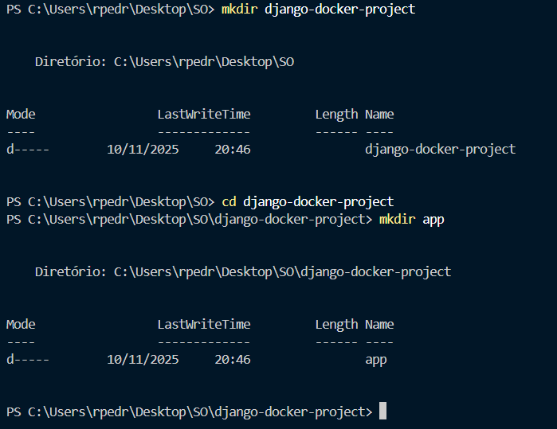
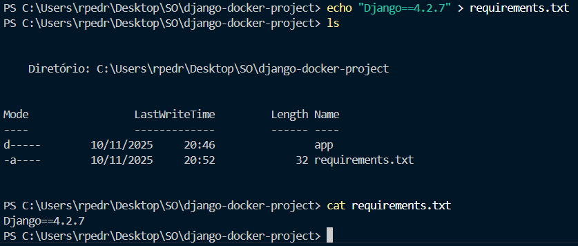
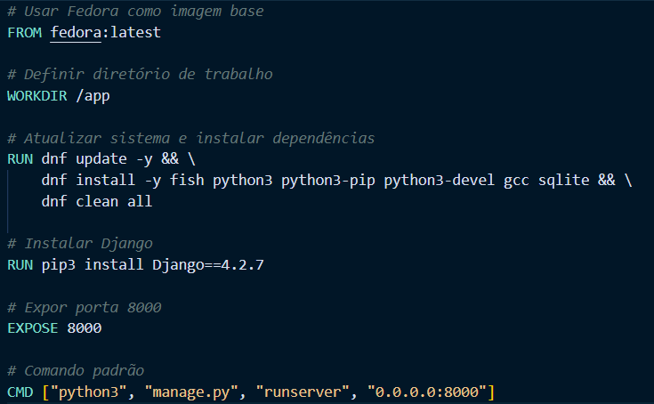
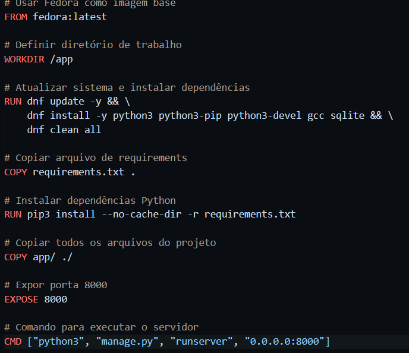
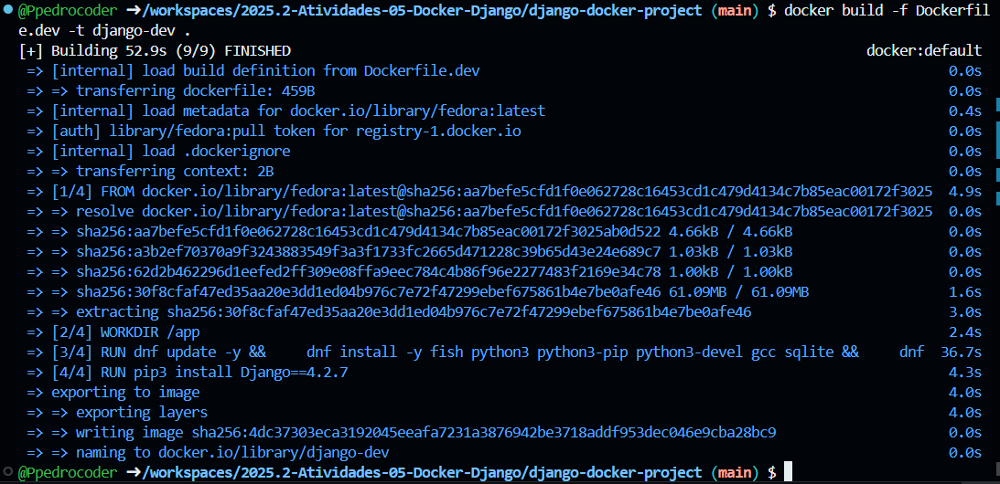
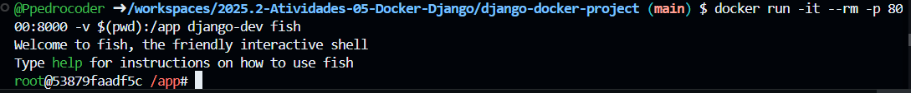
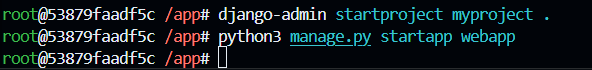
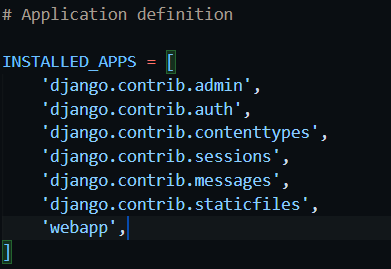
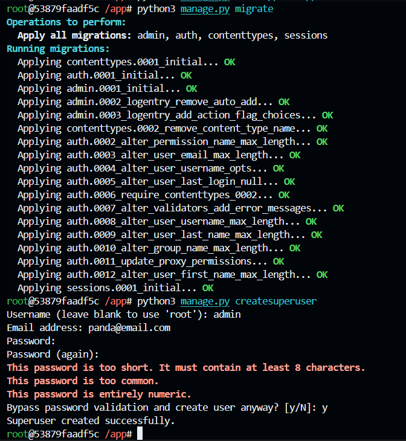

# Atividade Django com Docker - Pedro Ricardo - 10/11/2025 #

### 1. Criando Pastas ###

### 2. Criando Requirements.txt ###

### 3. Criando Dockerfile.dev ###

### 4. Criando Dockerfile.prod ###

### 4. Criando Imagem de Desenvolvimento ###

### 5. Executar Container de Desenvolvimento com Volume Mapeado ###

### 6. Criando Projeto e App com Django no Container ###

### 7. Adicionar a Aplicação ao Settings.py ###

### 8. Criar o Banco de Dados e Criar o Superusuário ###
